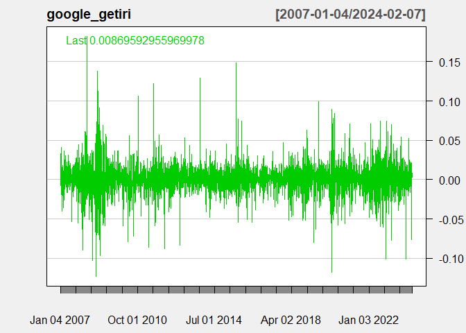
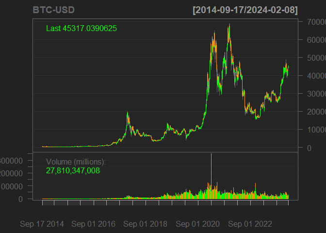

<style type="text/css"> 
body{
  background-color: #FAFAFA;
  font-size: 18px;
  line-height: 1.8;
}
code.r{
  font-size: 12pt;
}
</style>
<br>


Bu dokümanda R programı için yazılmış veri indirme paketleri tanıtılmıştır. Bazı çevrimiçi veri tabanları kişisel API oluşturulmasını gerektirmektedir. 

# Finansal Veriler


```r
library(tidyverse)
```


## `{quantmod}` Paketi  

(Quantitative Financial Modelling & Trading Framework for R)

Websitesi: [https://www.quantmod.com/](https://www.quantmod.com/)


```r
# install.packages("quantmod")
library(quantmod)
```

```
## Loading required package: xts
```

```
## Loading required package: zoo
```

```
## 
## Attaching package: 'zoo'
```

```
## The following objects are masked from 'package:base':
## 
##     as.Date, as.Date.numeric
```

```
## 
## ################################### WARNING ###################################
## # We noticed you have dplyr installed. The dplyr lag() function breaks how    #
## # base R's lag() function is supposed to work, which breaks lag(my_xts).      #
## #                                                                             #
## # Calls to lag(my_xts) that you enter or source() into this session won't     #
## # work correctly.                                                             #
## #                                                                             #
## # All package code is unaffected because it is protected by the R namespace   #
## # mechanism.                                                                  #
## #                                                                             #
## # Set `options(xts.warn_dplyr_breaks_lag = FALSE)` to suppress this warning.  #
## #                                                                             #
## # You can use stats::lag() to make sure you're not using dplyr::lag(), or you #
## # can add conflictRules('dplyr', exclude = 'lag') to your .Rprofile to stop   #
## # dplyr from breaking base R's lag() function.                                #
## ################################### WARNING ###################################
```

```
## 
## Attaching package: 'xts'
```

```
## The following objects are masked from 'package:dplyr':
## 
##     first, last
```

```
## Loading required package: TTR
```

```
## Registered S3 method overwritten by 'quantmod':
##   method            from
##   as.zoo.data.frame zoo
```

**ÖRNEK**: Apple hisse senedinin günlük verilerini 01-01-2018-24-03-2023 arasını kapsayacak şekilde indirelim: 

```r
# yil-ay-gün
getSymbols("AAPL", from='2018-01-01',to='2023-03-24')
```

```
## [1] "AAPL"
```

`AAPL` bir `xts` nesnesi olarak tanımlıdır.

```r
class(AAPL)
```

```
## [1] "xts" "zoo"
```


```r
# APPLE hisselerinin günlük kapanış fiyatları
plot(AAPL$AAPL.Close)
```

<!-- -->

`quantmod:ChartSeries()` fonksiyonu ile görselleştirme: 

```r
chartSeries(AAPL,
            type="line",
            theme=chartTheme('white'))
```

<!-- -->

Sadece 2020 yılı: 

```r
chartSeries(AAPL,
            type="line",
            subset='2020',
            theme=chartTheme('white'))
```

<!-- -->


```r
chartSeries(AAPL,
            type="bar", 
            subset="2021",
            theme=chartTheme('white'))
```

<!-- -->


Candle stick plot: 

```r
chartSeries(AAPL,
            type="candlesticks", 
            subset="2021-08",
            theme=chartTheme('white'))
```

<!-- -->

**Örnek**: Google hisselerinin günlük getiri oranları hesaplayarak grafiğini çizelim: 

```r
# GOOGLE hissesinin getiri oranı
library(quantmod)
getSymbols("GOOG")  
```

```
## [1] "GOOG"
```

```r
google_getiri <- diff(log(GOOG$GOOG.Adjusted)) # log getiri  oranı
chartSeries(google_getiri, theme="white")
```

<!-- -->

**Örnek**: Bitcoin günlük fiyatlar: 

```r
getSymbols("BTC-USD")
```

```
## [1] "BTC-USD"
```

```r
chartSeries(`BTC-USD`)
```

<!-- -->


**Örnek**: BIST100 Endeksi (Son dönem verileri güncellenmiyor)

```r
# BIST100 endeksinin verileri Yahoo Finansta eksik: 
quantmod::getSymbols("^XU100", from='2018-01-01',to='2023-03-24')
```

```
## Warning: ^XU100 contains missing values. Some functions will not work if
## objects contain missing values in the middle of the series. Consider using
## na.omit(), na.approx(), na.fill(), etc to remove or replace them.
```

```
## [1] "XU100"
```


## `{tidyquant}` Paketi

Finansal verilerin indirilmesi ve analizi için kullanabileceğimiz başka bir paket `{tidyquant}` paketidir. Bu paket `{tidyverse}` paketleri ile uyumlu çalışacak şekilde geliştirilmiştir. 

Daha fazla detay için bkz. [https://business-science.github.io/tidyquant/](https://business-science.github.io/tidyquant/)


```r
# install.packages("tidyquant")
library(tidyquant)
```


```r
# Microsoft hisse fiyatları 
# similar to quantmod::getSymbols()
microsoft <- tq_get(x = "MSFT")
head(microsoft)
```

```
## # A tibble: 6 × 8
##   symbol date        open  high   low close   volume adjusted
##   <chr>  <date>     <dbl> <dbl> <dbl> <dbl>    <dbl>    <dbl>
## 1 MSFT   2014-01-02  37.3  37.4  37.1  37.2 30632200     31.3
## 2 MSFT   2014-01-03  37.2  37.2  36.6  36.9 31134800     31.1
## 3 MSFT   2014-01-06  36.8  36.9  36.1  36.1 43603700     30.4
## 4 MSFT   2014-01-07  36.3  36.5  36.2  36.4 35802800     30.7
## 5 MSFT   2014-01-08  36    36.1  35.6  35.8 59971700     30.1
## 6 MSFT   2014-01-09  35.9  35.9  35.4  35.5 36516300     29.9
```

```r
# data is in tibble format
```


```r
# tidyquant::tq_get() is a wrapper for quantmod::getSymbols() but provides 
# additional data resources such as crypto assets
tq_get_options()
```

```
##  [1] "stock.prices"       "stock.prices.japan" "dividends"         
##  [4] "splits"             "economic.data"      "quandl"            
##  [7] "quandl.datatable"   "tiingo"             "tiingo.iex"        
## [10] "tiingo.crypto"      "alphavantager"      "alphavantage"      
## [13] "rblpapi"
```

Piyasa bilgilerini indirmek için: 

```r
tq_exchange_options()
```

```
## [1] "AMEX"   "NASDAQ" "NYSE"
```

Örneğin

```r
# nyse <- tq_exchange("NYSE")
# head(nyse)
```


```r
# endeks verileri için, 
tq_index_options()
```

```
## [1] "DOW"       "DOWGLOBAL" "SP400"     "SP500"     "SP600"
```


```r
# örneğin
sp500 <- tq_index("SP500")
```

```
## Getting holdings for SP500
```


```r
# SP500 içindeki hisse fiyatları
tq_index("SP500") %>%
    slice(1:3) %>% # sadece ilk 3 hisse
    tq_get(get = "stock.prices")
```

```
## Getting holdings for SP500
```

```
## # A tibble: 7,626 × 15
##    symbol company      identifier sedol weight sector shares_held local_currency
##    <chr>  <chr>        <chr>      <chr>  <dbl> <chr>        <dbl> <chr>         
##  1 MSFT   MICROSOFT C… 594918104  2588… 0.0734 -         85568020 USD           
##  2 MSFT   MICROSOFT C… 594918104  2588… 0.0734 -         85568020 USD           
##  3 MSFT   MICROSOFT C… 594918104  2588… 0.0734 -         85568020 USD           
##  4 MSFT   MICROSOFT C… 594918104  2588… 0.0734 -         85568020 USD           
##  5 MSFT   MICROSOFT C… 594918104  2588… 0.0734 -         85568020 USD           
##  6 MSFT   MICROSOFT C… 594918104  2588… 0.0734 -         85568020 USD           
##  7 MSFT   MICROSOFT C… 594918104  2588… 0.0734 -         85568020 USD           
##  8 MSFT   MICROSOFT C… 594918104  2588… 0.0734 -         85568020 USD           
##  9 MSFT   MICROSOFT C… 594918104  2588… 0.0734 -         85568020 USD           
## 10 MSFT   MICROSOFT C… 594918104  2588… 0.0734 -         85568020 USD           
## # ℹ 7,616 more rows
## # ℹ 7 more variables: date <date>, open <dbl>, high <dbl>, low <dbl>,
## #   close <dbl>, volume <dbl>, adjusted <dbl>
```

## `{Quandl}` Paketi

Visit [https://data.nasdaq.com/](https://data.nasdaq.com/). 

```r
# install.packages("Quandl")
library(Quandl)
```

Örnekler için bkz. 

[https://github.com/quandl/quandl-r](https://github.com/quandl/quandl-r). 

ve 

[https://data.nasdaq.com/tools/r](https://data.nasdaq.com/tools/r)

API anahtarı olmadan veri indirmenin günlük sınırı vardır. Bu nedenle API anahtarı girilmesi tavsiye edilir.  


# Dünya Bankası Verileri 

## `{WDI}` Paketi

Kullanım klavuzu ve örnekler için bkz. [https://github.com/vincentarelbundock/WDI](https://github.com/vincentarelbundock/WDI)


```r
# install.packages("WDI")
library(WDI)
```

**Örnek** Meksika, Türkiye, G. Kore, Malezya, ve ABD için kişi başına gayrisafi yurt içi hasıla (2015 sabit USD fiyatları ile): 

```r
gdppc = WDI(indicator = 'NY.GDP.PCAP.KD', 
            country = c('MEX','TUR', 'KOR', 'MYS', 'USA'), 
            start = 1960, 
            end = 2021)
head(gdppc)
```

```
##       country iso2c iso3c year NY.GDP.PCAP.KD
## 1 Korea, Rep.    KR   KOR 2021       32786.69
## 2 Korea, Rep.    KR   KOR 2020       31378.16
## 3 Korea, Rep.    KR   KOR 2019       31645.95
## 4 Korea, Rep.    KR   KOR 2018       31059.27
## 5 Korea, Rep.    KR   KOR 2017       30312.89
## 6 Korea, Rep.    KR   KOR 2016       29467.12
```


```r
gdppc |> ggplot(aes(year, NY.GDP.PCAP.KD, color = country)) + 
  geom_line() +
  scale_x_continuous(breaks = seq(1960,2020,10)) + 
  labs(x = "Year", 
       y = "GDP per capita") 
```

<!-- -->


## `{wbstats}` Paketi

Kullanım klavuzu ve örnekler için bkz. [https://cran.r-project.org/web/packages/wbstats/vignettes/wbstats.html](https://cran.r-project.org/web/packages/wbstats/vignettes/wbstats.html)


```r
# install.packages("wbstats")
library(wbstats)
```


```r
pop_data <- wb_data("SP.POP.TOTL", start_date = 2000, end_date = 2002)
head(pop_data)
```

```
## # A tibble: 6 × 9
##   iso2c iso3c country    date SP.POP.TOTL unit  obs_status footnote last_updated
##   <chr> <chr> <chr>     <dbl>       <dbl> <chr> <chr>      <chr>    <date>      
## 1 AW    ABW   Aruba      2000       89101 <NA>  <NA>       <NA>     2023-12-18  
## 2 AW    ABW   Aruba      2001       90691 <NA>  <NA>       <NA>     2023-12-18  
## 3 AW    ABW   Aruba      2002       91781 <NA>  <NA>       <NA>     2023-12-18  
## 4 AF    AFG   Afghanis…  2000    19542982 <NA>  <NA>       <NA>     2023-12-18  
## 5 AF    AFG   Afghanis…  2001    19688632 <NA>  <NA>       <NA>     2023-12-18  
## 6 AF    AFG   Afghanis…  2002    21000256 <NA>  <NA>       <NA>     2023-12-18
```


```r
# Örnek: NÜfus ve GDP verileri, tüm ülkeler, 1980-2021
my_indicators = c("pop" = "SP.POP.TOTL",
                  "gdp" = "NY.GDP.MKTP.CD")

pop_gdp <- wb_data(my_indicators, start_date = 1980, end_date = 2021)
head(pop_gdp)
```

```
## # A tibble: 6 × 6
##   iso2c iso3c country  date   gdp   pop
##   <chr> <chr> <chr>   <dbl> <dbl> <dbl>
## 1 AW    ABW   Aruba    1980    NA 62267
## 2 AW    ABW   Aruba    1981    NA 62614
## 3 AW    ABW   Aruba    1982    NA 63116
## 4 AW    ABW   Aruba    1983    NA 63683
## 5 AW    ABW   Aruba    1984    NA 64174
## 6 AW    ABW   Aruba    1985    NA 64478
```


# Penn World Tables 

Yaygın olarak kullanılan ülkeler arası başka bir veri tabanı Penn World Tables'dır. Son sürümü için bkz. [https://www.rug.nl/ggdc/productivity/pwt/?lang=en](https://www.rug.nl/ggdc/productivity/pwt/?lang=en)

## `{pwt}` Paketi 

CRAN websitesi için bkz. [https://cran.r-project.org/web/packages/pwt10/index.html](https://cran.r-project.org/web/packages/pwt10/index.html)

En son versiyon: pwt10.0, 

```r
# install.packages("pwt10")
library(pwt10)
data(pwt10.0)
# değişkenlerin tanımları için bkz. 
# ?pwt10.0
```


```r
pwt10.0 |> filter(country=="Turkey") |> 
  ggplot(aes(year, hc)) +
  geom_line() +
  labs(y = "Human Capital")
```

<!-- -->


# Federal Reserve Bank of St. Louis Veri Tabanı: FRED

Özellikle ABD verileri için zengin bir veri kaynağı sunmaktadır. Ayrıca çok sayıda ülke verisi de bulunmaktadır. FRED websitesi için bkz. [https://fred.stlouisfed.org/](https://fred.stlouisfed.org/)

FRED'den veri indirmek için `quantmod` paketi kullanılabilir. Ayrıca geliştirilmiş paketler de bulunmaktadır. 

## `{fredr}` Paketi

Kullanıma klavuzu için bkz.[http://sboysel.github.io/fredr/articles/fredr.html](http://sboysel.github.io/fredr/articles/fredr.html) ve 
[https://sboysel.github.io/fredr/](https://sboysel.github.io/fredr/)


```r
# install.packages("fredr")
library(fredr)
```

Paketi kullanabilmek için FRED'den API KEY alınması gerekmektedir. Detaylar için bkz. [https://fred.stlouisfed.org/docs/api/api_key.html](https://fred.stlouisfed.org/docs/api/api_key.html)


# Food and Agricultural Organization (FAO) Statistics 

## `{FAOSTAT}` Paketi

For more information visit 

[https://gitlab.com/paulrougieux/faostatpackage](https://gitlab.com/paulrougieux/faostatpackage)

and 

[https://cran.r-project.org/web/packages/FAOSTAT/index.html](https://cran.r-project.org/web/packages/FAOSTAT/index.html)

For bulk download: 
[https://github.com/muuankarski/faobulk](https://github.com/muuankarski/faobulk)

For vignettes: 

```r
vignette(topic = "FAOSTAT") 
```


```r
library(FAOSTAT)
```


# Eurostat Open Data 

## `{eurostat}` Paketi


[https://cran.r-project.org/web/packages/eurostat/index.html](https://cran.r-project.org/web/packages/eurostat/index.html)

[https://ropengov.github.io/eurostat/articles/eurostat_tutorial.html](https://ropengov.github.io/eurostat/articles/eurostat_tutorial.html)


```r
library(eurostat)
```


```r
# Table of contents
toc <- get_eurostat_toc()
```


```r
# Örnek
# Konut fiyat endeksi, çeyreklik
HPI <- get_eurostat("ei_hppi_q", time_format = "date")
```

```
## Dataset query already saved in cache_list.json...
```

```
## Reading cache file C:\Users\hntas\AppData\Local\Temp\Rtmpiw8JZg/eurostat/efa8ca5cb67bea1b67a5d1922942953d.rds
```

```
## Table  ei_hppi_q  read from cache file:  C:\Users\hntas\AppData\Local\Temp\Rtmpiw8JZg/eurostat/efa8ca5cb67bea1b67a5d1922942953d.rds
```


```r
# TR verileri 
tr_hpi <- HPI |> filter(unit=="I15_NSA", geo=="TR") |> 
  select(TIME_PERIOD, values) |> 
  rename(çeyrek = TIME_PERIOD,
         KFI = values)
# plot
tr_hpi |> ggplot(aes(çeyrek, KFI)) + 
  geom_line() +
  labs(title = "Konut Fiyat Endeksi")
```

<!-- -->


# OECD Data 

## `{OECD}` Paketi


[https://cran.r-project.org/web/packages/OECD/index.html](https://cran.r-project.org/web/packages/OECD/index.html)


[https://github.com/expersso/OECD](https://github.com/expersso/OECD)


```r
library(OECD)
```

```
## 
## Attaching package: 'OECD'
```

```
## The following object is masked from 'package:FAOSTAT':
## 
##     search_dataset
```


# IMF Data 

## `{IMFData}` Paketi

[https://github.com/mingjerli/IMFData](https://github.com/mingjerli/IMFData)


```r
devtools::install_github('mingjerli/IMFData')
```


# Kripto varlık fiyatları 

## `{crypto2}` Paketi

Bu paket <https://coinmarketcap.com> sitesinden kripto varlık fiyatlarını indirmek için tasarlanmıştır. Daha fazla bilgi ve örnekler için bkz. 

[https://github.com/sstoeckl/crypto2](https://github.com/sstoeckl/crypto2)


```r
library(tidyverse)
library(crypto2)
coins <- crypto_list(only_active=TRUE)
head(coins)
```

```
## # A tibble: 6 × 8
##      id  rank name      symbol slug      is_active first_historical_data
##   <int> <int> <chr>     <chr>  <chr>         <int> <date>               
## 1     1     1 Bitcoin   BTC    bitcoin           1 2010-07-13           
## 2     2    19 Litecoin  LTC    litecoin          1 2013-04-28           
## 3     3  1092 Namecoin  NMC    namecoin          1 2013-04-28           
## 4     4  7501 Terracoin TRC    terracoin         1 2013-04-28           
## 5     5   960 Peercoin  PPC    peercoin          1 2013-04-28           
## 6     6  6204 Novacoin  NVC    novacoin          1 2013-04-28           
## # ℹ 1 more variable: last_historical_data <date>
```


```r
coin_data <- crypto_history(coins, limit=3, start_date="20220101", end_date="20240207", finalWait=FALSE)
```

```
## ❯ Scraping historical crypto data
```

```
## 
```

```
## ❯ Processing historical crypto data
```

```
## 
```


```r
coin_data |> filter(symbol == "BTC") |> 
  ggplot(aes(timestamp, close)) +
  geom_line() +
  labs(y="Bitcoin kapanış fiyatı")
```

<!-- -->


<br>
<div class="tocify-extend-page" data-unique="tocify-extend-page" style="height: 0;"></div>
